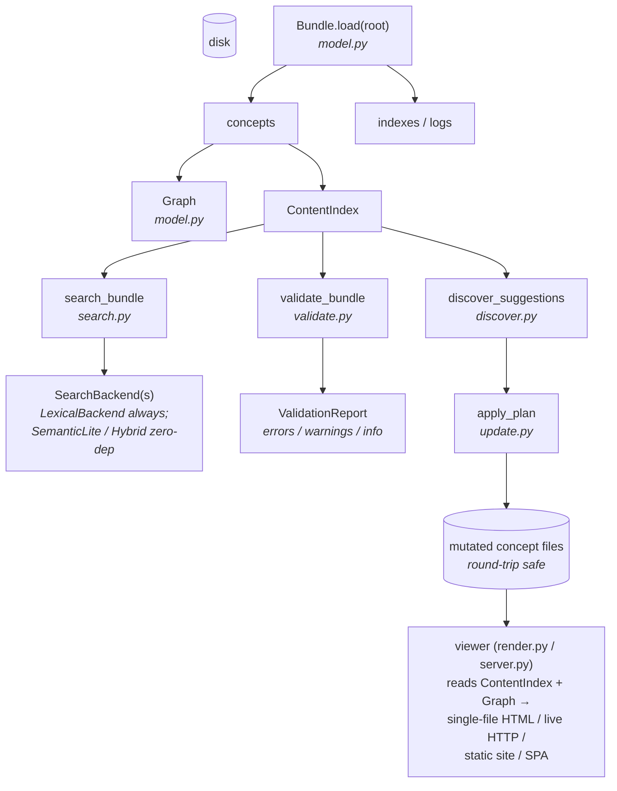
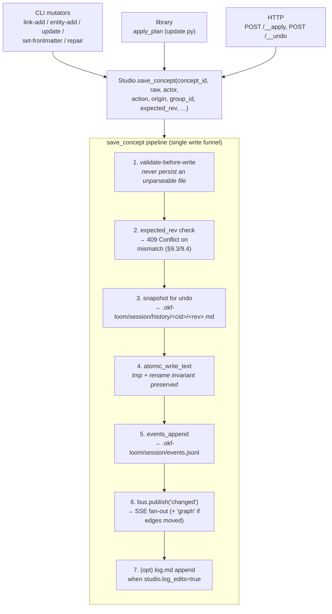
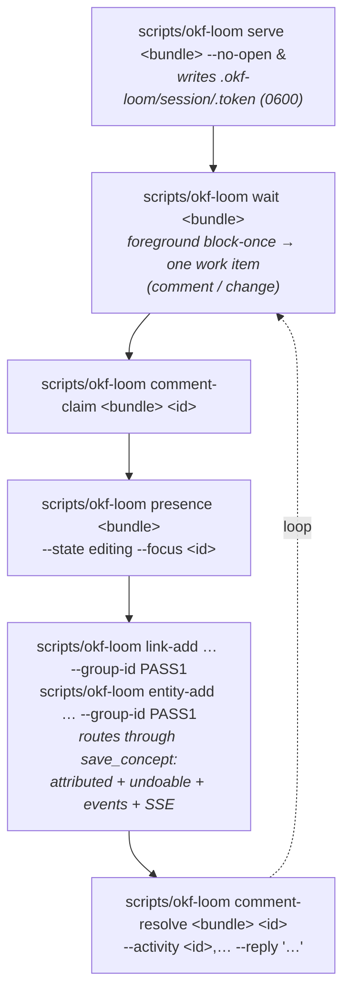

# Architecture

This document is the developer-facing reference for okf-loom: the
module map, the data flow, the extension points, the forward-compatibility
mechanisms, and the rationale. For best-of-breed research see
[`research.md`](/explanation/research.md); for harness-specific wiring see
[`embedding-guide.md`](/reference/embedding_guide.md).

## Design philosophy (in one paragraph)

OKF is intentionally minimal (SPEC §9). okf-loom mirrors that
philosophy: it is **permissive** (load never hard-fails on soft issues),
**layered** (cheap core, optional extras), and **single-source-of-truth**
(one canonical `ContentIndex` that every consumer reads). It is
**harness-agnostic** (no opinion on which agent framework consumes it)
and **forward-compatible** (a capability registry lets bundles opt into
optional extensions without spec changes). It is **dependency-light by
default** (PyYAML is preferred when present, with a conservative built-in fallback) so the same checkout runtime
runs in a CI runner, a meta-agent's subprocess, or an air-gapped
notebook.

## Module map

```
scripts/okf_loom/
├── __init__.py        — public API + versioning constants (SPEC_VERSION, RESERVED_FILENAMES, …)
├── __main__.py        — module entry used by the `scripts/okf-loom` helper
├── exceptions.py      — OKFError hierarchy
├── paths.py           — ConceptId = tuple[str,...]; segment validation; path<->id; reserved-name check; path_within_bundle symlink-containment guard
├── parse.py           — frontmatter parse + serialize; link extraction (BOTH forms + wikilinks); markdown->text
├── model.py           — Bundle, Concept, IndexFile, LogFile, Link, Graph, ContentIndex, Heading; has_wikilinks
├── ignore.py          — gitignore-style exclusion for bundle scanning (stdlib-only leaf): default excludes (hidden dirs, node_modules, nested git repos), .gitignore respect, bundle.exclude patterns, bundle.include add-backs (revive/reach/force semantics); iter_markdown_files pruning walker used by Bundle.load / serve watcher / import
├── validate.py        — SPEC §9 conformance + warnings; CheckSpec; ValidationReport (with profile); Finding
├── search.py          — SearchBackend Protocol; LexicalBackend (BM25) + SemanticLiteBackend + HybridBackend (RRF, all zero-dep); ENTITY/RELATION modes
├── discover.py        — 6 discovery rules; Suggestion; DiscoveryReport
├── plan.py            — PlannedAction/Plan; executable action-envelope planner (discovery + index staleness + relation mirroring)
├── update.py          — UpdatePlan/UpdateOp; 8 idempotent op kinds (incl. add_entity); safe round-trip via parse/serialize; accepts studio/actor/origin/group_id and threads them through every concept write (single-funnel attribution)
├── index.py           — SPEC §6 index.md regeneration; marker-safe; frozen CI mode; current spec §8 derived artifacts (emit_json)
├── log.py             — SPEC §7 log.md append-only helper
├── config.py          — okf-loom.config.yaml loader (bundle/viewer/search/validate/studio defaults); fail-closed bool + enum validation
├── bootstrap.py       — init / bootstrap / import scaffolding
├── extensions.py      — CapabilityRegistry + 25 built-in okf.cap.* capabilities (incl. aliases/provenance/citations/wikilinks/search_hybrid)
├── cli.py             — argparse dispatcher (one cmd_* function per subcommand); includes wait, token, comment-claim, comment-resolve, comment-list, presence; mutators carry --group-id / --actor and route through the live studio funnel when a session exists
├── render.py          — render_single_file + build_site (spa/static/single-file)
├── server.py          — live HTTP wiki server (stdlib only); OKFWikiHandler; mtime watcher (log-and-retry); SSE /__events, EventBus, /__comment, /__apply (with 409 conflict), /__undo, /__preview, /__diff, /__presence, /__data/{doc,events}, per-session CSRF + Origin/Host allow-list, --public ack gate, --no-watch-ui server-side enforcement
├── studio.py          — studio core: EventBus (subscribe/publish), Studio (single write funnel save_concept), presence, comments (claim/resolve), undo + group-undo, events.jsonl rotation, cross-process dedup; current spec §10-§13 library API (save_concept, post_presence, post_comment, resolve_comment, record_activity, events_append, post_suggestion)
├── watch.py           — scripts/okf-loom watch headless change feed (reuses _BundleWatcher)
└── viewer/
    ├── __init__.py    — lazy public re-exports
    ├── assets.py      — template/static/config/palette loaders (4 override points); two-layer active-code gate
    ├── markdown.py    — small stdlib Markdown renderer + internal-link rewriter
    ├── plugins.py     — entry-point ViewerPlugin loader (group okf_loom.viewer_plugins); CompositeViewerPlugin
    ├── OVERRIDES.md   — concrete examples of every override point
    ├── templates/     — single_file.html, concept_page.html, index_page.html, search_page.html, graph_page.html
    └── static/        — wiki.{css,js}, graph.{css,js}, live.js (SSE + patching), studio.{css,js} (views/comments/collab UI), static-search.js, renderers.js (progressive mermaid/KaTeX/highlight.js enhancement, shared by wiki pages, the graph detail panel, and the single-file export)
```

## Data flow



Three properties fall out of this:

1. **Cheap to load.** `Bundle.load` parses frontmatter and headings; it
   does not build the graph or the content index. Those are computed
   lazily and memoized on the Bundle instance (`bundle.graph()`,
   `bundle.content_index()`).
2. **One canonical model.** `ContentIndex` is the Quartz lesson (see
   `research.md` §A): search, graph, listings, and the viewer all read
   the same in-memory object. There is no second index for the viewer.
   `Graph.edges` retains authored occurrences; `Graph.logical_edges()`
   de-duplicates by `(source, relation type, target)` for rank/view consumers
   without erasing occurrence-level diagnostics.
3. **Mutations are round-trip.** Every writer (update.py, index.py,
   log.py) goes through `parse_document → modify → serialize_document`
   so unknown frontmatter keys and key order are preserved.

## Extension points (five)

okf-loom is extensible without forking. The five override surfaces:

1. **[Capability registry](/reference/capabilities.md)** (`extensions.py`). 25 built-in `okf.cap.*`
   capabilities (core/recommended/optional tiers), including the
   governed-key caps (`aliases`, `provenance`, `citations`, `entities`) and
   `wikilinks`/`search_hybrid` (auto-activate on `[[…]]` use / a hybrid
   search run). Bundles opt in via `okf_extensions:` in root `index.md`
   frontmatter or by using the governed keys (auto-activation). Plugins add
   capabilities at import time via `default_registry().register(Capability(...))`.
2. **Search backends** (`search.py`). `SearchBackend` Protocol. The
   `LexicalBackend` (BM25), `SemanticLiteBackend` (trigram+token TF cosine),
   and `HybridBackend` (RRF fusion of the two) all ship dependency-free.
   There is no shipped dense backend; broad paraphrase recall is a legitimate
   optional `SearchBackend` use case because a downstream agent cannot rerank
   a concept retrieval omitted. The CLI `--mode` flag dispatches to the
   matching shipped backend, with opt-in SemanticLite thresholds and Hybrid
   backend-evidence requirements.
3. **Viewer template / static / palette / config overrides**
   (`viewer/assets.py`). A bundle drops files under
   `.okf-loom/viewer/{templates,static}/`, `.okf-loom/viewer/palette.json`, or
   `.okf-loom/viewer/config.json` to customise rendering without code. Palette
   overrides are gated on the active-code gate AND validated against a strict
   CSS-color allowlist. See `viewer/OVERRIDES.md`.
4. **ViewerPlugin hook** (`viewer/plugins.py`, current spec §15).
   `on_concept_render(concept, html) -> html` (plus optional
   `on_index_render`). Plugins are discovered via the
   `okf_loom.viewer_plugins` entry-point group and called in registration
   order; raising plugins are logged and skipped. The two-layer active-code
   gate (bundle `viewer.allow_active_code` AND operator `--allow-active-code`
   / `OKF_LOOM_ALLOW_ACTIVE_CODE`) governs whether discovery runs at all. See
   `viewer/OVERRIDES.md` §5.
5. **Discovery rules** (`discover.py`). The six built-in rules
   (`unlinked_mentions`, `missing_indexes`, `missing_descriptions`,
   `broken_links`, `missing_relations_hint`, `orphan_concepts`) are
   module-level functions taking a `Bundle` and returning
   `list[Suggestion]`. Adding a rule = adding a function and a key in
   the `_RULES` registry.

## Forward compatibility

okf-loom must stay correct as the spec moves (v0.1 → 0.x → 1.0) and
let bundles extend without breaking. Four mechanisms:

1. **Spec-version tracking.** `SPEC_VERSION = "0.1"` is the single
   constant. On load, the bundle's declared `okf_version` is read; if it
   differs okf-loom does best-effort consumption and emits a warning
   (SPEC §11 mandate). The validator's `spec_version_check` rule makes
   this visible.
2. **Capability registry.** Optional behaviors live behind named
   capabilities (`okf.cap.typed_relations`, `okf.cap.entities`,
   `okf.cap.aliases`, `okf.cap.provenance`, `okf.cap.citations`,
   `okf.cap.wikilinks`, `okf.cap.search_hybrid`, `okf.cap.embeddings`,
   `okf.cap.discovery_ner`, `okf.cap.diataxis_types`,
   `okf.cap.jsonld_export`, `okf.cap.multi_bundle`, … — 25 built-in total).
   They are recognised-if-present, never required. `okf.cap.wikilinks`
   auto-activates on `[[…]]` body syntax (`bundle.has_wikilinks`);
   `okf.cap.search_hybrid` activates when a hybrid search runs; the rest
   activate on their governed frontmatter keys. User-defined capabilities use
   a custom namespace (`acme.x`) and a JSON-schema fragment for the keys
   they introduce.
3. **Migration hooks.** `scripts/okf-loom upgrade --check` / `--apply` runs idempotent
   `migrate(old -> new, bundle)` transformers reusing the same pipeline.
   No migrations are defined for v0.1 (it is the baseline).
4. **Safe auto-update of bundle structure.** `index.md` regeneration
   skips hand-authored files (or rewrites only inside
   `<!-- okf:generated:index begin/end -->` markers, or replaces files
   with `generated: true` frontmatter). `log.md` updates are always
   append-only. Discovery finds gaps and emits a structured plan; the agent that
   manages the bundle applies its edits directly through the mutators (the CLI
   also offers a reviewable-plan workflow, but `apply_plan` itself never auto-runs
   from inside discovery — it is always called explicitly by the agent or user).
   A `--frozen` mode for CI fails loudly rather than
   writing to hand-authored files.

## Performance characteristics

- **Load.** O(N) over files; one YAML parse per file; no graph
  or content index is built. Suitable for thousand-concept bundles in
  well under a second.
- **Graph / ContentIndex.** Computed lazily on first call; memoized on
  the `Bundle` instance. Cheap to rebuild by re-loading the bundle.
- **Search (lexical).** O(N) per query over the in-memory corpus.
  Suitable up to ~10k concepts in a single process; beyond that, swap in
  a sqlite-vec- or API-embedding-backed custom `SearchBackend`.
- **Viewer (live server).** Per-request markdown render is O(body size).
  Bundle reload on file change is O(N); the watcher polls mtime every 1s.
- **All writes are atomic.** tmp file + `os.replace`; no partial state
  visible to concurrent readers.

## The live collaborative studio layer

`scripts/okf-loom serve` runs a **live collaborative studio**: the user reads
and **directs via comments**; an **external agent authors** the OKF files in
real time through the same mutators it always uses. Every change appears
live, in place, with no full-page refresh. The full current design lives in
[`spec.md`](/reference/spec.md); this section is the developer map. Three
new modules (`studio.py`, `watch.py`, plus extensions to `server.py` /
`cli.py` / `update.py`) carry it; the wire format stays OKF SPEC v0.1.

### Studio layer — `studio.py`

Two classes carry the in-process studio:

- **`EventBus`** — thread-safe fan-out. Each subscriber gets a bounded
  `queue.Queue` (default 64); `publish(event)` enqueues to every
  subscriber in registration order; a slow subscriber drops deltas and
  gets one `resync` event so it never blocks the publisher. `subscribe()`
  takes an optional callback (the in-process embedding shape, §17) or
  returns the queue for the caller to poll. `client_count()` and
  `unsubscribe(sub)` manage lifecycle.
- **`Studio`** — the per-bundle studio handle. Constructed via
  `Studio.for_bundle(bundle_root, *, session_rel=".okf-loom/session",
  log_edits=True, bundle_name="", max_queue=64)`; `ensure_session()`
  creates the session dir + the per-session CSRF token (`.token`, 0600).

#### Single internal write funnel — `Studio.save_concept(...)`

`save_concept` is the **single internal atomic write path** every concept
write goes through, whoever the caller is:



Because every writer goes through the same funnel, **attribution is
exact** (`actor` + `origin`), **undo is always available** (snapshot +
optional group manifest under `.okf-loom/session/history/<group_id>/`), and
the **change list is complete** (one `events.jsonl` row per write). There
is no duplicated bookkeeping between the CLI and HTTP paths.

`apply_plan` (update.py) accepts `studio` / `actor` / `origin` /
`group_id` and threads them through every op, so a multi-op pass is one
group-undoable unit. `_handle_apply` and `_handle_undo` in `server.py`
call `save_concept` / `restore_snapshot` directly — the HTTP layer stays
a thin wrapper over the same funnel (current spec §10/§13).

CLI mutators detect a live session via `_maybe_studio_for_bundle` and
route through `_studio_aware_apply`. **Without** a session (no
`.okf-loom/session/`) they fall back to the non-studio atomic write path —
same data-safety, but no attribution / undo / events / SSE.

### Session storage — `<bundle>/.okf-loom/session/`

All session state lives under `<bundle>/.okf-loom/session/` (configurable via
`studio.session_dir`). It is **ephemeral** (recommend `.gitignore`);
deleting it loses only the live feed + undo, never the content or the
permanent `log.md`.

| File / dir | Purpose | Lifetime |
|---|---|---|
| `events.jsonl` | The single change/event log (current spec §11/§13). One JSON-line event per write. Powers the change list, the SSE stream, and `scripts/okf-loom watch --since`. Rotates at the cap (default 8 MiB) to `events-YYYYMMDD-NN.jsonl`. | ephemeral |
| `directives.jsonl` | User comments / asks (current spec §12). One JSON-line directive per comment. `open` → `claimed` → `resolved` / `dismissed`. | ephemeral |
| `presence.json` | Agent presence (current spec §12): `{actor, state, focus, ts}`. State ∈ `idle`/`watching`/`thinking`/`editing`. | ephemeral |
| `.token` | Per-session CSRF token (`X-OKF-Token`), written 0600 on `scripts/okf-loom serve` boot. Read by `scripts/okf-loom token` and attached by the studio's own JS. | per-session |
| `.last-logged.json` | Cross-process dedup index (current spec §13). Maps the most-recent `rev` logged per concept so the watcher's disk-backfill never double-logs a write that already logged itself. | ephemeral |
| `history/` | Undo snapshots (current spec §13). `history/<cid>/<rev>.md` is a capped ring per concept; `history/<group_id>/` carries the group manifest for one-click group undo. | ephemeral |
| `_groups/` | Group-undo manifests (one per `--group-id` pass): the concept ids + revs to restore. | ephemeral |
| `proposals.jsonl` | **Only under a user's opt-in `propose_only` constraint** (current spec §10): the agent appends `PlannedAction` envelopes here for review. Absent by default. | ephemeral |

### The agent loop (current spec §12)

The agent is the **processor**; it does not run a background daemon. The
canonical foreground loop:



`scripts/okf-loom wait --for comment` (default) blocks for the next `open` user
comment; `--for change` for proactive enrichment; `--for comment change`
for whichever arrives first. **Run it in the agent foreground** (you are
the processor); backgrounding it (`scripts/okf-loom wait &`) leaves returned work
unconsumed. `scripts/okf-loom watch` is the continuous-tail counterpart for piping
the feed to a long-running external consumer.

### Cross-process dedup model (current spec §13)

Several writers can mutate the bundle concurrently — the agent's CLI
mutator calls, `scripts/okf-loom watch --auto-repair`, the user editing files in
their own editor, and direct CLI. Each appends its own fully-attributed
event through one helper, `Studio.events_append(event)`, under a short
advisory file lock (`fcntl.flock` POSIX / `msvcrt.locking` Windows; the
fallback is a single-line `O_APPEND` write, which is atomic for small
records on POSIX). For changes that **weren't** logged by a studio
writer (the user's editor, any outside tool), the `_BundleWatcher`
detects the mtime change, diffs the `ContentIndex`, and appends an
`origin:"disk"` event; `.last-logged.json` de-dupes by `rev` so the
watcher never double-logs a write that already logged itself. The feed
is therefore complete regardless of which path produced the change.

### Trust model — single-user local admin (current spec §14)

The user is the admin and is **never gated**. The studio keeps exactly
the protections that cost the user zero friction and defend against
things that are not the user:

- **Loopback by default.** `scripts/okf-loom serve` binds `127.0.0.1`. Exposing the
  port to a network (`--public`, or a non-loopback `--host`) requires
  either `--public-ack` (non-interactive, CI) or an interactive `y/N`
  ack; the server refuses to start otherwise (exit 2). Closes the
  warn-only gap on a non-loopback bind (current spec §14).
- **Per-session CSRF token** (`X-OKF-Token`). Written to
  `.okf-loom/session/.token` (mode 0600) on boot, embedded in the served
  page, auto-attached by the studio's own JS to mutating requests. Read
  it with `scripts/okf-loom token <bundle>` when you must POST over HTTP directly.
- **Origin AND Host allow-list.** Every mutating endpoint
  (`POST /__comment` / `/__apply` / `/__undo` / `/__presence`) checks
  **both** `Origin` and `Host` against `allowed_hosts` (default
  `[127.0.0.1, localhost]`; never empty). The Host check (current spec §14) closes
  a DNS-rebinding hole that forging only the `Origin` could exploit.
- **`--no-watch-ui` enforced server-side (current spec §11/§14).** When SSE / live UI is
  off, `/__events` returns `503` and the watcher is skipped entirely —
  not just hidden on the client.
- **`--no-edit` refuses writes at the route layer.** Live reads stay
  available; all `POST` endpoints are disabled.
- **Malicious-bundle code is still gated** behind the existing two-layer
  active-code gate (bundle `viewer.allow_active_code: true` AND operator
  `--allow-active-code` / `OKF_LOOM_ALLOW_ACTIVE_CODE`). Editing / saving /
  watching are explicitly **not** behind this gate.
- **Data-safety invariants** (correctness, not permission): validate
  before write (never persist an unparseable file), the `parse.py` /
  `markdown.py` DoS caps (including the nested-list recursion cap on
  `/__preview`), `paths.path_within_bundle` containment, atomic writes
  (tmp + rename), optimistic per-doc `rev`, and `/__apply` mapping ids →
  known `UpdateOp`s (never a shell/argv string). `rev` + `group_id` are
  validated against `_SAFE_PATH_TOKEN_RE` before any filesystem op under
  `history/` (§9.5).

**Summary:** the studio gates the port and the bundle's code, never the
user or their agent. The user's safety net for agent-authored edits is
the **live change list + (group) undo**, not an approval step.

### Conflict handling (§9.3 / §9.4)

Because the agent is the sole writer of `.md` files through the studio,
there is no user↔agent merge problem day-to-day. `rev = sha1(raw)[:12]`
per-doc keeps live updates coherent. The one real collision — the user
editing a file directly on disk at the same moment the agent writes it —
surfaces non-destructively: `POST /__apply` with a stale `expected_rev`
returns `409` with `{conflict, expected_rev, current_rev}` (no silent
clobber), and `GET /__diff?id=&from=&to=` returns a line diff for the
banner's "View diff" affordance.

## Test suite

- `tests/test_<module>.py` per source module.
- `tests/fixtures/{tiny_good,tiny_bad,empty_bundle}/` cover the format
  surface (both link forms, typed relations, generated index, log.md,
  missing-description case, broken-link case, malformed frontmatter).
- `tests/test_integration.py` runs full load → validate → discover →
  plan → apply → re-validate loops against the upstream
  `ga4`/`stackoverflow`/`crypto_bitcoin` bundles (marked
  `@pytest.mark.integration`).
- Run the suite: `cd okf-loom && python -m pytest`.
- Fast subset: `python -m pytest -m "not integration"` (≈1.5s).

## What okf-loom deliberately is NOT

- It is not a producer/enrichment agent. Upstream's `reference_agent`
  writes bundles by crawling BigQuery + the web; okf-loom consumes,
  validates, curates, and renders bundles produced by anyone.
- It is not a replacement for the upstream base wire-format spec.
  [`/reference/spec.md`](/reference/spec.md) governs current okf-loom behavior
  on top of upstream OKF SPEC v0.1.
- It is not a hosted service. The viewer is a static-site / live-dev
  server; it does not assume a database, an account system, or a network.
- It is not coupled to any specific agent framework. See
  `embedding_guide.md` for wiring recipes.

## References

- Current okf-loom spec: [`/reference/spec.md`](/reference/spec.md)
- Upstream base OKF SPEC v0.1: https://github.com/GoogleCloudPlatform/knowledge-catalog/blob/main/okf/SPEC.md
- Upstream reference implementation: the upstream OKF SPEC repository (external)
- Best-of-breed research: `docs-bundle/explanation/research.md`
- Harness wiring: `docs-bundle/reference/embedding_guide.md`
- Override examples: `scripts/okf_loom/viewer/OVERRIDES.md`
