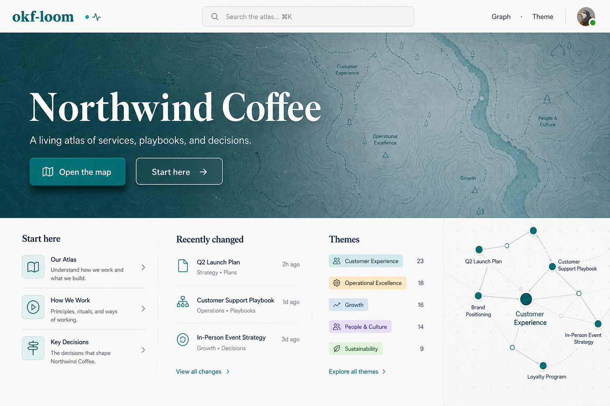
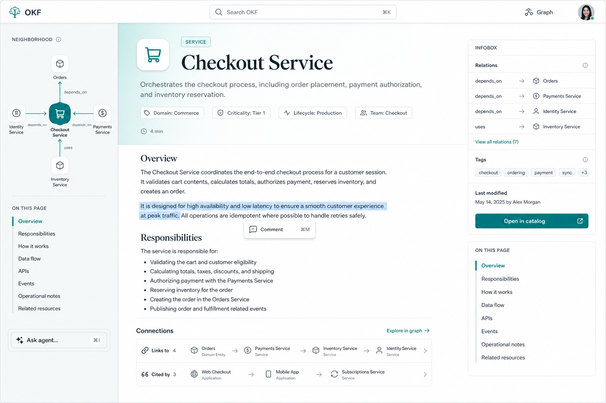
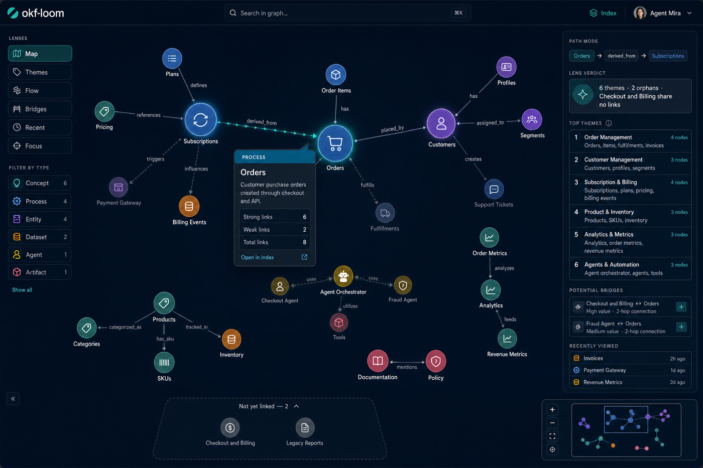
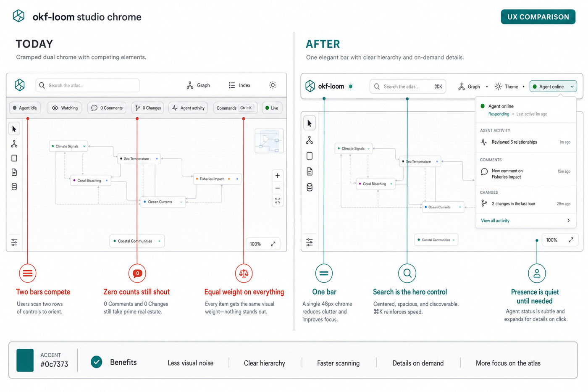

# UX vision — from polished wiki to living atlas

Assessment date: 2026-07-27, against the live studio on `docs-bundle`
plus checked-in media (`docs/media/*`) and the prior plans in
[`ui-overhaul-plan.md`](ui-overhaul-plan.md) / [`graph-lenses.md`](graph-lenses.md).

> **Status (2026-07-28):** Implemented on branch `cursor/atlas-composition-pass-84ca`
> — chrome merge (A), atlas home (B), concept infobox anatomy (C), graph calm
> default + orphan shelf + path chip (D), search filters / empty-state (E).

Mockups (aspirational references that guided the ship):

| # | Surface | File |
|---|---|---|
| 1 | Atlas home | [`mockups/mockup-01-atlas-home.png`](mockups/mockup-01-atlas-home.png) |
| 2 | Concept page | [`mockups/mockup-02-concept-page.png`](mockups/mockup-02-concept-page.png) |
| 3 | Graph as a place | [`mockups/mockup-03-graph-place.png`](mockups/mockup-03-graph-place.png) |
| 4 | Chrome before/after | [`mockups/mockup-04-chrome-before-after.png`](mockups/mockup-04-chrome-before-after.png) |

---

## 1. Verdict

The July overhaul largely landed: tokens, themes, 76ch measure, type icons,
index cards, graph lenses, ranked lens panels, comment composer, local
neighbourhood widget. Foundations are strong.

What still holds the product back is **composition and progressive
disclosure**, not missing widgets. The studio still reads as a capable
dev-tool wiki with a graph applet bolted on. The next leap is product
identity: **a living atlas** — home that orients, pages that feel authored,
a graph you want to open, chrome that stays quiet.

One sentence: ship fewer always-on controls, put structured knowledge above
the fold, and make density a lens choice instead of the default.

---

## 2. What is working (keep)

- **Design tokens + theme discipline** in `wiki.css` (teal accent with WCAG
  notes, OKLCH state colours, five themes). Do not throw this away.
- **Type as identity seed** — icon + accent colour on cards, chips, and
  graph nodes. Extend; don't invent a second system.
- **Graph lenses** (Map / Themes / Flow / Bridges / Recent / Focus) with
  question-named modes and ranked verdicts — the strongest unique surface.
  See [`graph-lenses.md`](graph-lenses.md).
- **Right-hand detail / lens panel** — answers beside the picture.
- **Comment → agent loop** (select text, ask, claim/resolve) — the
  collaboration differentiator. Keep the interaction; restyle the chrome.
- **Shared renderer** (serve / static / SSE patches) — restyle at
  CSS/template level; don't rewrite the pipeline for visuals.

---

## 3. What still hurts (evidence)

### 3.1 Dual chrome shouts when nothing is happening

Every page pays a ~100px tax: topbar (search, Graph, Index, theme) + studio
bar (Agent idle, Watching, 0 Comments, 0 Changes, Agent activity, Commands,
Live). Zeros and idle states get equal weight with the brand and search.

Evidence: live index first viewport; `docs/media/studio-home.png`,
`search.png`, `graph-map.png`.

→ Visual target: mockup 4.

### 3.2 Index first viewport is a README, not an atlas

Above the fold today: serif H1, three quiet stats, a small "Explore the
graph" pill in the stats row, then hand-authored `index.md` prose that
restates the bundle. The useful **type card grids** exist — but only after
scrolling past the essay.

The overhaul plan's "dashboard" (start here, recent, graph thumbnail) never
became the first composition; cards are a catalog under a blog intro.

→ Visual target: mockup 1.

### 3.3 Concept pages still bury structure

Type chip + title + description are present; governed frontmatter still
reads as a clinical dump; relations are lists; sidebar panels compete
(neighbourhood / sections / quick actions as equal boxes in older shots).
Structured OKF value is easy to miss next to prose.

→ Visual target: mockup 2.

### 3.4 Graph default is still a hairball

Lenses and icons improved meaning, but Map on the docs bundle (~30 nodes /
~200+ edges) remains dense spaghetti. Edge reduction, orphan shelf as a
visible authoring TODO, and "strong edges first" are under-emphasized in
the default view. Interaction power (hover dim, path, focus) is easy to
miss — shift-click path lives in a footer hint.

→ Visual target: mockup 3.

### 3.5 Search is a flat list

Type icons and snippets exist; no type filter rail, no grouping when
results are many, empty-query "recent / start here" is weak compared to
what the atlas home should own.

---

## 4. Design principles for the next leap

1. **One chrome.** Search is the hero control. Presence collapses to one
   quiet control; comments/changes appear only when non-zero or when the
   drawer opens.
2. **First viewport = orientation.** Brand/bundle name, one lede, one CTA
   group, then Start here / Recent / Themes / map invitation — not a wall
   of cards or a second essay.
3. **Structure before prose.** Infobox + typed relations + neighbourhood
   earn the right rail; markdown body is for reading.
4. **Density is a lens, not a default.** Calm Map with progressive edge
   disclosure; hairball only if the user asks for "show all links".
5. **Same type language everywhere.** Icon + colour on home, cards, search,
   concept header, graph nodes, legend filters — already started; finish
   the consistency pass.
6. **Motion with purpose.** Hover lift + neighbourhood dim, lens transitions,
   edge flow on selection — not decorative glow.

Preserve the teal atlas identity. Avoid purple-SaaS, cream-serif-terracotta,
and broadsheet hairline layouts.

---

## 5. Visual directions (what the mockups propose)

### 5.1 Atlas home — mockup 1

- Full-bleed atmospheric hero (map texture / soft topo) with **bundle name
  as the brand signal**, one lede, primary "Open the map" + secondary
  "Start here".
- Below: four orientation rails — Start here, Recently changed, Themes,
  mini-graph invitation — **not** every concept card.
- Card grids by type move to a secondary "Browse all" / type filter view
  (or below the orientation band with a clear jump link).
- Hand-authored `index.md` intro becomes optional lede or a linked
  "About this bundle" concept — it should not own the first scroll.

### 5.2 Concept page — mockup 2

- Type-tinted header: icon, type chip, title, lede, entity/meta chips,
  reading time.
- **One left rail**: neighbourhood mini-graph + On this page (scroll-spy).
  Quick actions collapse to a single "Ask agent…" entry.
- **Right infobox**: typed relations with arrows, tags, last modified,
  resource CTA. No duplicate TOC.
- Connections footer: compact Links to / Cited by rows with type icons;
  "Explore in graph" jump.
- Comment affordance stays on selection; chrome stays single-bar.

### 5.3 Graph as a place — mockup 3

- Default Map: fewer visible edges (strong/typed first), clear community
  spacing, orphan tray at the bottom edge.
- Hover: neighbourhood dim + tooltip card; selection: path chip + edge flow.
- Lenses as a compact vertical or segmented question list; type legend as
  filter chips.
- Right panel keeps verdicts and ranked lists; add path breadcrumb and
  (later) bridge suggestions feeding `discover`.
- Minimap + zoom cluster bottom-right only.

### 5.4 Chrome collapse — mockup 4

| Today | After |
|---|---|
| Two bars, ~10 equal chips | One 48px bar |
| "0 Comments" always visible | Badge only when count > 0 |
| Search is a side field | Search centered / hero |
| Agent idle + Watching + Live | One presence control → drawer |

Commands (`Ctrl+K`) merges into the same search/command palette — one
keyboard home.

---

## 6. Suggested build order

Ordered for visible wins without a rewrite. Builds on leftover items from
[`ui-overhaul-plan.md`](ui-overhaul-plan.md) phases 3–5 that never fully
changed the *composition*.

| Step | Work | Primary files | Why first |
|---|---|---|---|
| **A. Chrome** | Merge topbar + studio bar; zero-count hide; presence drawer; search as hero | `studio.css`, `studio.js`, templates | Pays off on every page immediately |
| **B. Atlas home** | Hero composition; Start here / Recent / Themes / mini-graph; demote full card wall | `index_page.html`, `render.py`, `wiki.css`, `studio.js` | Fixes first impression |
| **C. Concept anatomy** | Infobox rail; merge sidebar; typed connection rows; demote QA | `concept_page.html`, markdown render, `wiki.css` | Makes OKF structure visible |
| **D. Graph calm default** | Edge progressive disclosure; orphan shelf emphasis; hover tooltip polish; path chip UI | `graph.js`, `graph.css` | Makes the map inviting |
| **E. Search polish** | Type filter chips; group-by-type; empty-state recents | `wiki.js` / search templates | Completes wayfinding |

Ride-alongs: keep a11y token comments current; extend
`scripts/capture_*` with before/after for A–D into `docs/screenshots/`.

Out of scope for this vision (already well-argued elsewhere): new lens
algorithms, matrix view, time scrubber — see Future candidates in
[`graph-lenses.md`](graph-lenses.md).

---

## 7. Success criteria (feel tests)

- **Brand test:** remove the nav — the first viewport still reads as *this*
  bundle's atlas, not a generic docs theme.
- **Quiet chrome test:** with zero comments and an idle agent, the only
  persistent studio signal is a small presence/live cue.
- **Orient in 5 seconds:** a new reader can name where to start, what
  changed lately, and how to open the map without scrolling the essay.
- **Structure glance test:** on a concept page, type, relations, and
  neighbourhood are readable before reading the body.
- **Graph calm test:** default Map does not require squinting through
  overlapping labels/edges; path and focus are discoverable without reading
  footer hints.

---

## 8. Relationship to prior plans

- [`ui-overhaul-plan.md`](ui-overhaul-plan.md) (2026-07-01) — phases 1–5
  largely implemented at the component level; **this doc is the composition
  pass** that those phases described but did not fully realize on the first
  viewport / chrome.
- [`graph-lenses.md`](graph-lenses.md) (2026-07-02) — keep the lens set and
  evidence base; this vision adds **default calm + progressive edge
  disclosure** and stronger orphan/path affordances on top.
